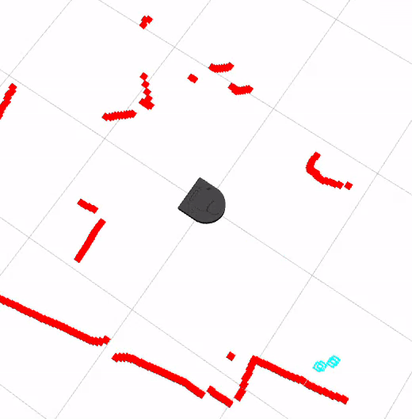

# CompRobo FA2023: Warmup Project

Brooke Moss, Lauren Thorbecke, Swasti Jain

## Project Description:

As the warm-up project for A Computational Introduction to Robotics ("CompRobo") Fall 2023, we were tasked to use ROS2 tools to allow our Neato robotic vacuum to perform a number of tasks of increasing complexity.

The tasks are as follows:

-   Teleop: Control the Neato using keystrokes on a laptop. Using `WASD` keys, control the robot's forward/backward motion and turning.

-   Driving in a Square: Write a simple ROS node where the robot drives forward a set distance, turns 90 degrees, and repeats until it has drawn a square.

-   Wall Following: Have the Neato autonomously drive parallel to a wall, at a set distance from the wall.

-   Person Following: Have the Neato detect and follow a person walking in front of it, staying a set distance behind.

-   Obstacle Avoidance:

-   Multi-Behaviour:

## Implementation:

### Teleop

For the tele-op section of the project, the goal was to allow keystrokes on a laptop to manually control the robot's motion and orientation. To implement this, we decided to use a toggle-style control scheme. For example, a `W` keypress would cause the robot to move forward at a set speed until it received further instruction.

#### Code Structure

Within the Node object, we included the initialization method and two additional methods. One method, `drive()`, was a helper, taking a linear or angular velocity and sending a command to the Neato to move as such. To capture the keystrokes on the laptop, we defined a `getKey()` function (not within the Node object) that waited for the next keystroke and returned which key was pressed.

Then, within the method `run_loop()`, a loop continually calls `getKey()` to update the currently-pressed key. If the stop code `Ctrl + C` is pressed, the loop exits and the robot stops. Otherwise, a `W` keypress calls the `drive()` function to drive straight forward, `S` drives straight back, `A` turns left, and `D` turns right. When any key other than these 4 are pressed, the robot stops driving, but remains enabled and able to drive.

#### Issues

Initially, we wanted to use the keystrokes in a different manner, where the robot would move in a given direction only while the key was held down, and would stop when the key was released. However, the key-listener code we were given was restrictive here. Because the listener would just wait until a key was pressed, the execution of the node would be stuck within this function, preventing us from stopping the robot when no keys are pressed.

As a workaround, we allowed any keys other than `WASD` to stop the robot, rather than just a key-release.

### Drive Square

For DriveSquare, we were tasked with making the Neato drive in the shape of a square. One option to make this happen was using the odometry from the robot's encoders to estimate how far it has moved and what angle it is turned to. Instead, we decided to just use timers. In our implementation, the robot drives forward for a given time period, turns left for a given time period, and repeats 3 more times until it has drawn a square.

{fig-alt="A GIF of a robotic vacuum cleaner driving in a square." fig-align="left"}

#### Code Structure

Similarly to the Teleop section, we included a `drive()` method that takes an angular and a linear velocity and sends a movement command to the Neato. In addition, we wrote a pair of methods that each call `drive()`. `turn_left()` commands the Neato to start spinning to the left, then waits a time equivalent to 0.5pi over the angular velocity before bringing the Neato to a stop. This roughly equates to 90 degrees of turn. Similarly, the method `drive_forward()` takes a distance to drive forward, begins driving at a speed, waits for a time equal to the distance over the velocity, and then brings the Neato to a halt. This solution allows the Neato to drive forward roughly the given distance.

FInally, there is a `run_loop()` method that runs a loop 4 times and calls both `drive_forward()` and `turn_left()` with each loop.

#### Issues

We didn't have any major issues with this exercise, although the the delay-based strategy for getting the robot to turn 90 degrees seemed to have some accuracy issues, especially when we moved from the simulator to the physical Neato.

### Wall Following

There were two primary components to the control goals of the wall following exercise. First, we wanted the robot to remain oriented parallel to the wall. Second, we wanted the robot to remain a prescribed distance away from the wall. For this exercise, we used the Neato's LiDAR scan data to keep track of its position and orientation relative to the wall. With each set of LiDAR scan data, we determined which data point held the shortest distance measurement. This told us where the robot was facing relative to the wall, as the shortest distance from the robot to the wall would make up a line perpendicular to the wall, telling us how many degrees the Neato is from parallel to the wall. We could also use this same shortest distance measurement to determine whether we were near our target distance or needed to move closer or further from the wall.

{fig-alt="A GIF of a robotic vacuum following a wall at a set distance."}

#### Code Structure

After the `handle_scan()` method processes the incoming scan and determines the shortest measurement, most of the logic for this exercise happens in the `run_loop()` method. First, we calculate the difference between the angle of the shortest measurement and what this angle would be if we were parallel to the wall, giving an angle representing the divergence from a parallel path.

Next, we check whether we are too far, too close, or the right distance from the wall. If we are too close, we turn the Neato away from the wall. If too far, we turn the Neato toward the wall. If we are around the right distance, we turn the Neato back to parallel. Because the Neato's linear velocity is constant in this implementation, all we have to adjust is the angular velocity to get it to reliably follow the wall.

#### Issues

Before making the linear velocity constant, when the Neato would stray slightly off of its intended trajectory, it would fully stop and try to realign itself. This made forward progress very slow. We solved this by making the forward velocity constant, allowing the angular adjustments to happen while the Neato continued making forward progress!

If we wanted to expand this further, we could add a bump sensor-based stop, allowing the robot to actually stop. We could also implement a more complex method of setting the forward velocity rather than just setting it once and forgetting it.

### Person Following

For this exercise, we were tasked with detecting a human in the forward field of vision of the Neato and following them. The goal was to keep the person directly ahead of the Neato, and the Neato a given distance behind. The way we decided to implement this is relatively simple, relying only on the LiDAR data to detect and follow the person. With each scan, we detect groups of LiDAR points within a certain distance of the Neato (assumed to be legs), calculate a rough center point for each leg, and then find an average point between those, determining the "center" of the person to aim for. From there, the logic is very similar to the wall follower logic, steering toward a targeted angle and distance.

#### Code Structure

The `handle_scan()` method goes through each scan, looking for points in the forward-facing range, with a distance of less than 2 meters. Once a point is found, it makes a list of subsequent points of a similar distance, assumed to be more data on the same leg. By taking an average of the angles and distances of these points, a rough center of the leg can be determined using `calc_CoM()`. Although a more complex method could have been used, this seemed to work reasonably well. After detecting some number of legs, a centroid is calculated using the `calc_centroid()` method, determining the target to drive toward.

The `run_loop()` method first takes the distance to the centroid and determines whether the robot is too close to or too far from the person. If too close, linear velocity is set to zero, and if too far, the robot drives forward. Next, it checks whether the its heading aligned with the direction of the person. Based on this, the robot turns left or right to re-align (or doesn't, if already aligned).

#### Issues

Although the following seems to work okay, especially given the rudimentary algorithm I have implemented, it the Neato does seem to get confused sometimes. This is likely because I did not implement any filtering to keep it from detecting walls in addition to people. This would explain why the simulated Neato seems to follow a moving cylinder in an empty world, but the real Neato seems to follow me until it gives up and starts driving in circles.

### Obstacle Avoidance

We divided the LiDAR data into two groups: a slice of LiDAR data directly ahead of the robot, and periphery LiDAR data of the sides of the robot. These two groups were each broken into left and right, creating a total of four sets of LiDAR data. The function with the role of processing the data intakes a full 360 degree scan and discards unneeded data before it splits it into these four lists. Before feeding the four lists into the movement decision-making function, it checks if there is anything directly ahead of the robot (in which case the robot enters the function for turning the robot until the forward bearing is clear).

{width="600"}

The Neato chooses a path forward by choosing an angular velocity about the center of the Neato and a linear forward velocity. The angular velocity is determined by the minimum values of the periphery scan. If either periphery scan list has an obstacle within 0.7 meters, the angular velocity given a non-zero value that is proportional to the distance from the obstacle. The closer an obstacle is, the higher the angular velocity is. The direction to turn is determined by which side a closer obstacle is detected on. The linear velocity is determined by how close an object is detected in the datasets for directly ahead of the robot. If there is no obstacle within 0.5 meters, the Neato drives forward at 0.2 meters per second. If There is an obstacle closer than that, the Neato adjusts its speed based on how close the obstacle is, such that it slows down the closer it gets to an obstacle.

If the Neato gets too close to an obstacle directly ahead or next to it, the previous angular and linear velocities are overridden and the Neato stops moving before entering the function that causes it to back up and turn. The turning function uses periphery data to decide which direction to turn in: it will turn away from the side with the closer obstacles.

These functions run in a constantly updating loop.

{fig-alt="A GIF of a robot vacuum simulator driving and avoiding obstacles."}

### Multi-Behaviour

## Takeaways:

-   Visualizations and concept maps are essential to robotics programming. This can be done through print statements, pseudocode and state diagrams, rviz, Gazebo. A simple mistake in your thinking will be much easier to see live than in lines of code.

-   Sometimes simpler is better. For obstacle avoidance, we could have used RANSAC or other line fitting algorithms and created potential maps - it turns out a simpler algorthim worked just as well and took much less time to implement and troubleshoot.